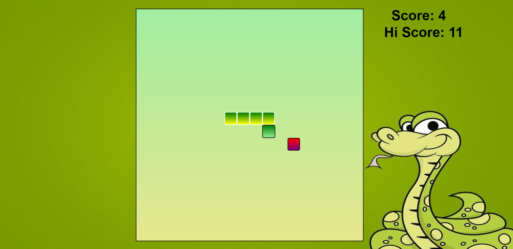

# 🐍 Snake Game

A classic **Snake Game** built using **HTML**, **CSS**, and **JavaScript**.  
Eat the food, grow the snake, and avoid hitting the walls or yourself!

## 🎮 Features

- 🐍 Smooth and responsive snake movement
- 🍎 Food spawns at random positions
- 🧠 Score tracking
- 💾 High score stored using `localStorage`

## 🧠 How to Play

- Use the arrow keys (`↑`, `↓`, `←`, `→`) to move the snake
- Eat the food to increase your score
- Avoid hitting the walls or your own body
- Try to beat your high score!

